# **Pinterest Data Pipeline project**
Pinterest crunches billions of data points every day to decide how to provide more value to their users. In this project, we create a similar system using the AWS Cloud.
## **Milestone2** 
Initial process to sign in to AWS to start building the data pipeline.
-   **Task1:**        
    -   To get hands on on some infrastructure similar to industry standard while working as Data Engineer
    -   In the script *user_posting_emulation.py* which contains three tables with data resembling data received by the pinterest API when a POST request is made by a user uploading data to Pinterest:
        -   *pinterest_data* contains data about posts being updated to Pinterest.
        -   *geolocation_data* contains data about the geolocation of each Pinterest post found in pinterest_data.
        -   *user_data* contains data about the user that has uploaded each post found in pinterest_data
-   **Task2:**
    -   To sign in AWS console with Account_ID, IAM user name. 

## **Milestone3** 
Configuration of Amazon EC2 instance to use an Apache Kafka client machine.
-   **Task1:**
    -  Create *key pair* file (.pem key file) locally
        - Step1:
            -   Create key piar file locally which will ultimately allow to connect to EC2 instance. Navigate to **Parameter store** in AWS account.
            - Using *KeyPairID*, find specific key pair associated with your EC2 instance. Select the *key pair* under the *value* field select *show*. Copy entirely inc;uding BEGIN and END header and paste in the .pem file created in VSCode.
        - Step2:
            -   Navigate to EC2 console and identify the instance with your unique UserId.
-   **Task2:**
    -   Using *Connect* instructions(SSH client) connect to the EC2 instance:
    **ssh -i "0xxnxxxxnnnx-key-pair.pem" root@ec2-nn-nnn-nn-nn.compute-n.amazonaws.com**.
-   **Task3:**
    Here AWS account has been provided with access to an IAM authenticated MSK cluster. In order to connect to IAM authenticated cluster, we need to install the appropriate packages on EC2 client machine.
    -   Step1:
        -  First, install Kafka on client EC2 machine. 
        -   Here we install ***Java***  using  below command:
        *sudo yum install java-1.8.0* 
        - Then we download Apache Kafka using below command:
        **wget https://archive.apache.org/dist/kafka/2.8.1/kafka_2.12-2.8.1.tgz**     
        **tar -xzf kafka_2.12-2.8.1.tgz**
        - This creates Kafka directory inside EC2 client.
    - Step2:
        -   To connect to a cluster that uses IAM authentication, we need to follow additional steps before we are ready to create a topic on our client machine.
        -   First, navigate to Kafka installation folder and then in the libs folder. Inside here we will download the IAM MSK authentication package from Github, using the following command:  
        ***wget https://github.com/aws/aws-msk-iam-auth/releases/download/v1.1.5/aws-msk-iam-auth-1.1.5-all.jar***
    - Step3:
        -   Before IAM cluster authentication, it is required to replace ARN with assigned ARN IN IAM.
        -   Navigate IAM console -> Roles section -> select the one with the following format: <your_UserId>-ec2-access-role -> Go to the Trust relationships tab and select Edit trust policy ->   Click on the Add a principal button and select IAM roles as the Principal type ->   Replace ARN with the <your_UserId>-ec2-access-role ARN you have just copied
        -   By above steps, ARN has necessary permissions to authenticate to the MSK cluster.
    - Step4:
        -   To configure Kafka client to use AWS IAM authentication to the cluster, we need to modify the *client.properties* file inside kafka_folder/bin directorey. If not present we can create it. PSB:
        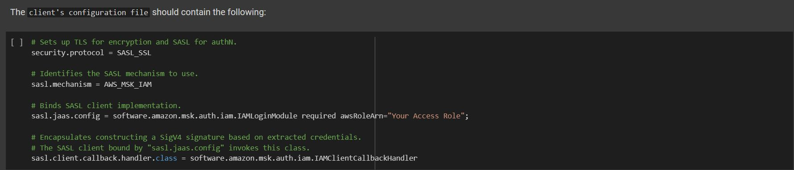

-   **Task4:**
    To create Kafka topics.
    - Step1:
        -   To create kafka topic, certain information retrieval is necessary about MSK cluster: 
            -   *Bootstrap servers string*          
            -  *Plaintext Apache Zookeeper connection string*  
            Above information is retreived from the MSK Management console.
        -   Post which we create the following three topics:
            -   <your_UserId>.pin for the Pinterest posts data
            -   <your_UserId>.geo for the post geolocation data
            -   <your_UserId>.user for the post user data
            command as below:
            **./kafka-topics.sh --bootstrap-server BootstrapServerString --command-config client.properties --create --topic <topic_name>**
            e.g.:
            **./kafka-topics.sh --bootstrap-server b-1.pinterestmskcluster.w8g8jt.c12.kafka.us-east-1.amazonaws.com:9098,b-3.pinterestmskcluster.w8g8jt.c12.kafka.us-east-1.amazonaws.com:9098,b-2.pinterestmskcluster.w8g8jt.c12.kafka.us-east-1.amazonaws.com:9098 --command-config client.properties --create --topic 0ac1babf620d.user**
            note: Above commands will work, if CLASSPATH variable is set
            To set up the CLASSPATH environment variable, you can use the following command in .bashrc file using nano ~/.bashrc and then source ~/.bashrc:
            **export CLASSPATH=/home/ec2-user/kafka_2.12-2.8.1/libs/aws-msk-iam-auth-1.1.5-all.jar**

## **Milestone4** 
-   **Task1:**
    To Create  a custoem plugin with MSK Connect
    -   Step1:
        -   In S3 console, get the name of bucket with format as follows: user-<your_UserId>-bucket.
    -   Step2:
        -   Download the *Confluent.io* Amazon S3 connector on EC2 client and copy it to S3 bucket we noted from above. 
        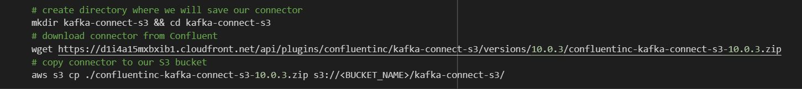
    -   Step3:
        - Create the custome plugin in MSK Connect Console with name as '<your_UserId>-plugin'.
        - To create custom plugin, find the bucket -> select the Zip file of confluent.io from the folder -> give a name  and hit *create custome plugin*.
        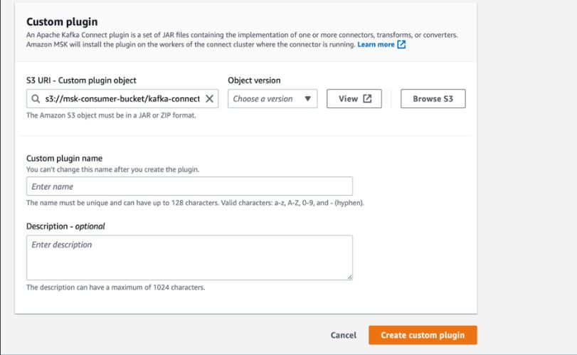    

-   **Task2:**
    Create a connector with MSK Connect.
        - Create Connector: Select *Connector* -> Create Connector -> from list, select above created plugin -> choose connector name as: <your_UserId>-connector and choose MSK cluster from the cluster list.
        - Certain points to take in consideration with respect to configuration:
            -   Check for S3 bucket name.
            -   Check for topics.regex in connector configuration, structure should be: <your_UserId>.*: to ensure it goes through all the Kafka topics created will be saved to S3 bucket.
            -   Make sure to choose IAM role used for MSK cluster in Access permission tab.
            Role format : <your_UserId>-ec2-access-role.
            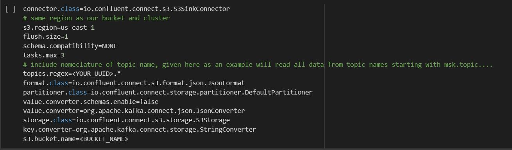
        This plugin-connector pair we built, data passing through IAM authentication cluster, automatically store in the designated S3 bucket.  

## **Milestone5**
Batch Processing: Configuring an API in API Gateway
-   **Task1:**
    Build a Kafka REST proxy integration method for the API
    -   Step1:
        -   To build a proxy integration for API, create a resource. 
        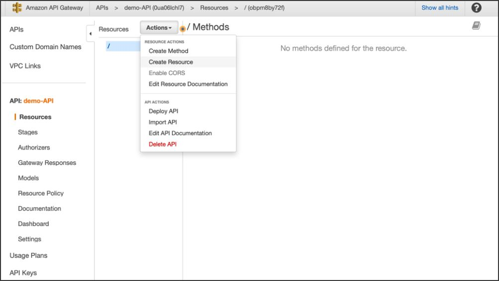
    -   Step2:
        -   For the above created resource, create a HTTP *ANY* method, set up the *Endpoint URL*, and copy the correct *PublicDNS* from the EC2.
    -   Step3:
        - Deploy the API with note of *Invoke URL*   
-   **Task2:**
    Setting up the kafka REST proxy on EC2 instance
    -   Step1:
        -   Install the confluent package for the Kafka REST Proxy on EC2 client machine.
    -   Step2:
        -   REST Proxy to perform IAM Authentication to the MSK cluster by modifying the kafka-rest.properties file.
    -   Step3:    
        - Start the REST proxy on the EC2 client machine.using below command:  
        **./kafka-rest-start /home/ec2-user/confluent-7.2.0/etc/kafka-rest/kafka-rest.properties**
        P.S. : *If everything went well, and your proxy is ready to received requests from the API, you should see a INFO Server started, listening for requests... in your EC2 console.*
-   **Task3:**
    Data is ready to be sent to API, which in turn will send the data to the MSK cluster using plugin-connector pair previously created.
    -   Step1:
        -   Updating the code to send data to the kafka topics created using API Invoke URL. Data would be sent from three tables to their corresponding kafka topic.
    -   Step2:
        -   We check for the data being sent to the cluster by running the kafka consumer (for each topic). We can see the messages being consumed
        command as follows:
        **./kafka-console-consumer.sh --bootstrap-server b-1.pinterestmskcluster.w8g8jt.c12.kafka.us-east-1.amazonaws.com:9098,b-3.pinterestmskcluster.w8g8jt.c12.kafka.us-east-1.amazonaws.com:9098,b-2.pinterestmskcluster.w8g8jt.c12.kafka.us-east-1.amazonaws.com:9098 --consumer.config client.properties --group students --topic 0ac1babf620d.pin --from-beginning**
    -   Step3:
        -   Check if data is getting stored in the S3 bucket. Notice the folder organization (e.g topics/<your_UserId>.pin/partition=0/) that your connector creates in the bucket. Here we cna see as below:
        
## **Milestone6**
Batch Processing: Databricks
-   **Task1:**
        -   To setup Databricks account.
-   **Task2:**
    -   Mount a S3 Bucket to Databricks
    For further data processing including to clean and process the data we need to read the data from S3 bucket into Databricks. This requires to mount the S3 bucket to Databricks Account. This requires the access key and secret access key creation for Databricks using IAM. the generated file needs to be uploaded into Databricks.
    To check the file we use command **'dbutils.fs.ls(“/FileStore/tables”)'**  
    -    The secret access key is encoded using urllib.parse.quote for security purposes. safe="" means that every character will be encoded.
    -   Mount S3 bucket:
        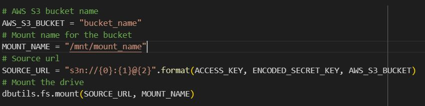
    - Read the JSON format dataset from S3 into Databricks:
        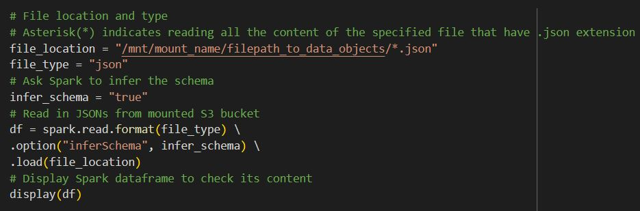
    - Three different dataframes are created:
        -   geo_df
        -   pin_df
        -   user_df
## **Milestone7**
Batch Processing: Spark on Databricks
-   **Task1:**
    -   To clean the df_pin DataFrame you should perform the following transformations:
        - Replace empty entries and entries with no relevant data in each column with Nones:
        ```
        cleaned_df_pin = df_pin.replace({'User Info Error': None, 'Image src error.': None}, subset =['follower_count','image_src'])
        ```
        -   Perform the necessary transformations on the follower_count to ensure every entry is a number. Make sure the data type of this column is an int.
            -   Using *contains* and *regex* for the tranformation with *cast*:
            ```
            cleaned_df_pin
                    .withColumn("follower_count", when(col("follower_count").contains("k"), 
                    regexp_replace("follower_count", "k", "").cast("double") *1000)
            ```         
        -   Ensure that each column containing numeric data has a numeric data type
        -   Clean the data in the save_location column to include only the save location path
            -   Using *regex_replace* as shown for above transformation.
        -   Rename the index column to ind.
            -   For name change used *withColumnRenamed*
        -   Reorder the DataFrame columns to have the following column order:
            1.   ind
            2.   unique_id
            3.   title
            4.  description
            5.  follower_count
            6.  poster_name
            7.  tag_list
            8.  is_image_or_video
            9.  image_src
            10. save_location
            11. category
            -   For column rearrange use *select*.       
-   **Task2:**
    -   To clean the df_geo DataFrame you should perform the following transformations:

        -   Create a new column coordinates that contains an array based on the latitude and longitude columns
            -   Using *array* combined latitude and longitude
        -   Drop the latitude and longitude columns from the DataFrame
            -   Using *drop*
        -   Convert the timestamp column from a string to a timestamp data type
            -   Using *to_timestamp*
        -   Reorder the DataFrame columns to have the following column order:
            1.  ind
            2.  country
            3.  coordinates
            4.  timestamp
-   **Task3:**
    -   To clean the df_user DataFrame you should perform the following transformations:

    -   Create a new column user_name that concatenates the information found in the first_name and last_name columns
    -   Drop the first_name and last_name columns from the DataFrame
        -   Using *concat* to join and *lit* for spacing between first name and last name.
    -   Convert the date_joined column from a string to a timestamp data type
    -   Reorder the DataFrame columns to have the following column order:
        1.  ind
        2.  user_name
        3.  age
        4.  date_joined
-   **Task4:**
    -   Find the most popular Pinterest category people post to based on their country.

        -   Your query should return a DataFrame that contains the following columns:
            1.  country
            2.  category
            3.  category_count, a new column containing the desired query output

        ```
        from pyspark.sql.functions import col, sum, avg, count, year, to_date, when, max
        pin_geo_combined_df = cleaned_df_pin.join(cleaned_df_geo, cleaned_df_geo["ind"] == cleaned_df_pin["ind"], how="inner")
        #display(pin_geo_combined_df)
        pin_geo_grouped_df = pin_geo_combined_df.groupBy("country", "category").agg(count("category").alias("category_count")).orderBy("country", col("category_count").desc())
        display(pin_geo_grouped_df)
        ```
        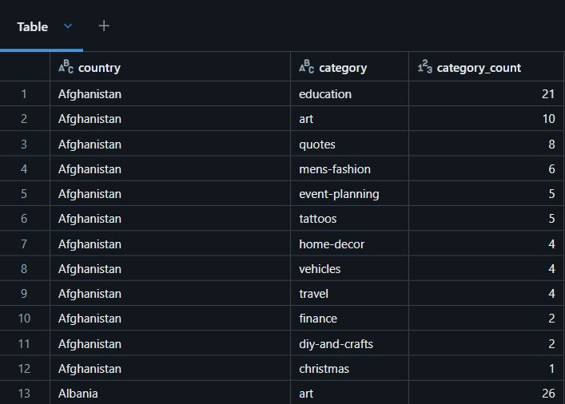
-   **Task5:**
    -   Your query should return a DataFrame that contains the following columns:

        1.  post_year, a new column that contains only the year from the timestamp column
        2.  category
        3.  category_count, a new column containing the desired query output

        ```
        pin_geo_year_df = pin_geo_combined_df.withColumn("post_year", year(col("timestamp")))
        #display(pin_geo_year_df)
        #Define year range
        start_year = 2018
        end_year = 2022
        pin_geo_grouped_year_df = pin_geo_year_df \
            .filter((col("post_year") >= start_year) & (col("post_year") <= end_year)) \
            .groupBy("post_year", "category") \
            .agg(count("category").alias("category_count")) \
            .orderBy("post_year", col("category_count").desc())
        display(pin_geo_grouped_year_df)
        ```
         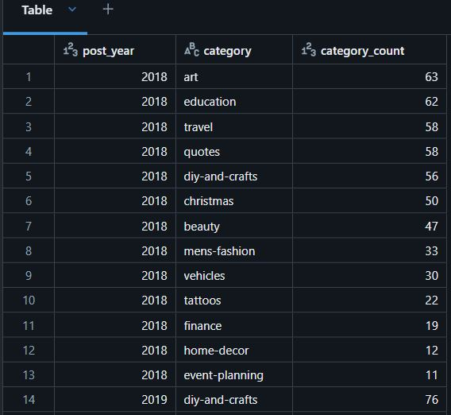
-   **Task6:**
    -  Your query should return a DataFrame that contains the following columns:

        1.  country
        2.  poster_name
        3.  follower_count
    -   Your query should return a DataFrame that contains the following columns:
        1.  country
        2.  follower_count
    ```
       pin_geo_followers_df = pin_geo_combined_df \
         .groupBy("country","poster_name","follower_count") \
        .agg(sum("follower_count")) \
        .orderBy("country","poster_name",col("follower_count").desc())    
        display(pin_geo_followers_df)

       pin_geo_max_follower_df = pin_geo_followers_df \
        .groupBy("country","follower_count") \
        .agg(max("follower_count")) \
        .orderBy("country",col("follower_count").desc())

        display(pin_geo_max_follower_df.limit(1)) 
    ```
    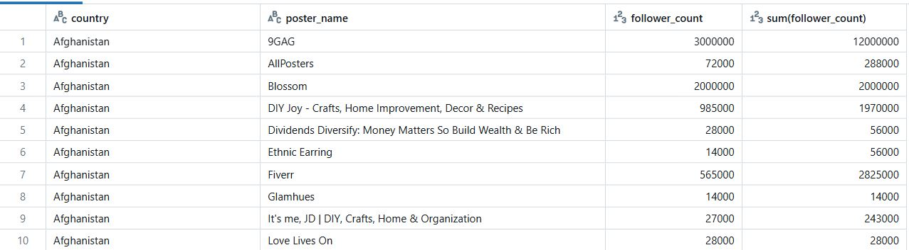  

    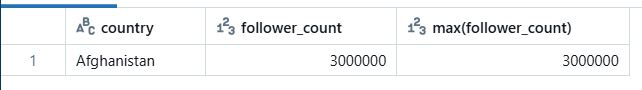

-   **Task7:**
    -     the most popular category people post to based on the following age groups:

        1.  18-24
        2.  25-35
        3.  36-50
        4.    +50
    Your query should return a DataFrame that contains the following columns:

    1.  age_group, a new column based on the original age column
    2.  category
    3.  category_count, a new column containing the desired query output      
    ```
    pin_user_combined_df = cleaned_df_pin.join(cleaned_df_user, cleaned_df_user["ind"] == cleaned_df_pin["ind"], how="inner")
    display(pin_user_combined_df)
    age_group_col = (
    when((col("age") >= 18) & (col("age") <=24), "18-24")
    .when((col("age") >= 25) & (col("age") <= 35), "25-35")
    .when((col("age") >= 36) & (col("age") <= 50), "36-50")
    .when(col("age") > 50, "+50")
    )
    ```
    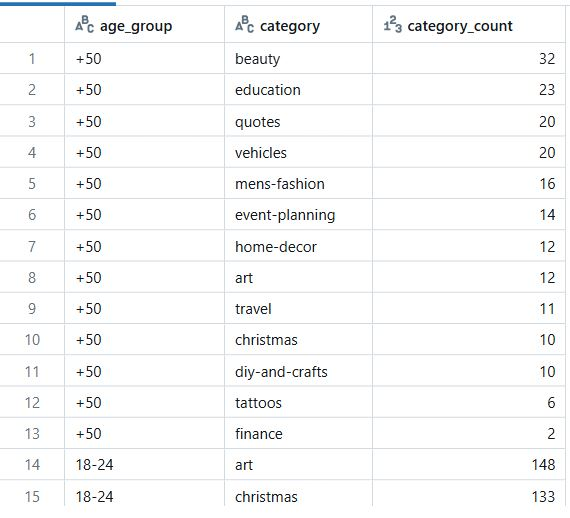

-   **Task8:**
    -   What is the median follower count for users in the following age groups:

    1.    18-24
    2.    25-35
    3.    36-50
    4.    +50
    Your query should return a DataFrame that contains the following columns:

    1.  age_group, a new column based on the original age column
    2.  median_follower_count, a new column containing the desired query output
    ```
    # Calculate median for each age group
    for group in age_groups:
        group_df = pin_user_df_with_age_groups.filter(col("age_group") == group)
        median = group_df.approxQuantile("follower_count", [0.5], 0.01)[0]  # Median with approxQuantile
        age_group_medians.append((group, median))
    ```
    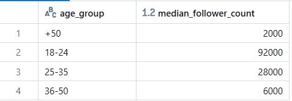 

-   **Task9:**    
    -   Find how many users have joined between 2015 and 2020.

    -   Your query should return a DataFrame that contains the following columns:
    1.  post_year, a new column that contains only the year from the timestamp column
    2.  number_users_joined, a new column containing the desired query output
    ```
    # Extract the year from the timestamp column
    df_with_year = cleaned_df_user.withColumn("post_year", year(col("date_joined")))

    # Filter the DataFrame for users who joined between 2015 and 2020
    filtered_df = df_with_year.filter((col("post_year") >= 2015) & (col("post_year") <= 2020))

    # Group by the year and count the number of users
    result_df = filtered_df.groupBy("post_year").agg(count("ind").alias("number_users_joined"))

    # Order the results by year
    result_df = result_df.orderBy("post_year")

    # Display the result
    display(result_df)
    ```
    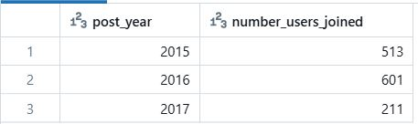

-   **Task10:**  
    -   Find the median follower count of users have joined between 2015 and 2020.


    Your query should return a DataFrame that contains the following columns:

    1.  post_year, a new column that contains only the year from the timestamp column
    2.  median_follower_count, a new column containing the desired query output
    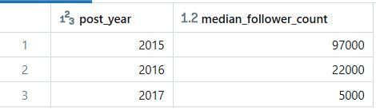
-   **Task11:**
    -   Find the median follower count of users that have joined between 2015 and 2020, based on which age group they are part of.


    Your query should return a DataFrame that contains the following columns:

    1.  age_group, a new column based on the original age column
    2.  post_year, a new column that contains only the year from the timestamp column
    3.  median_follower_count, a new column containing the desired query output
    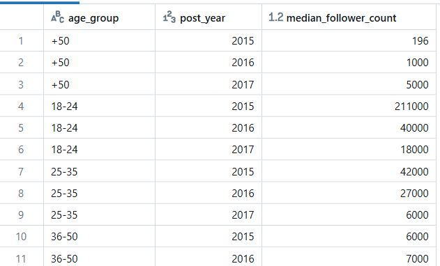
